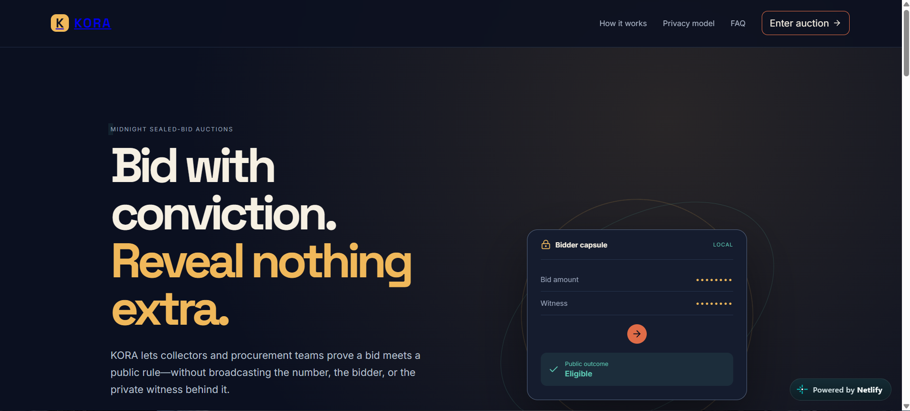
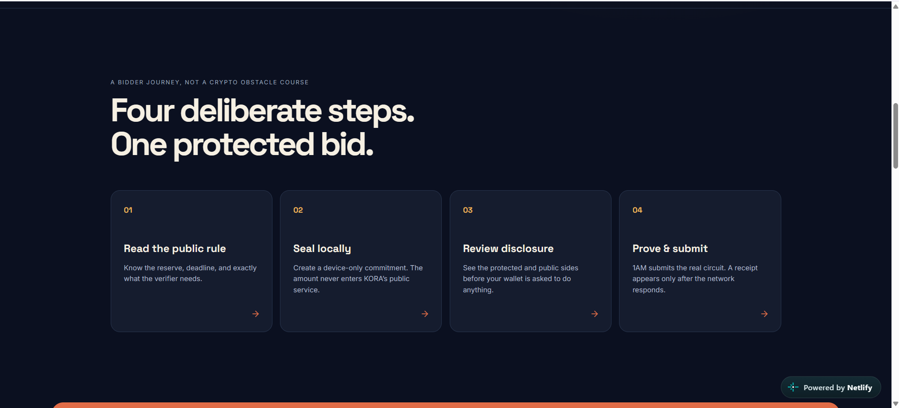
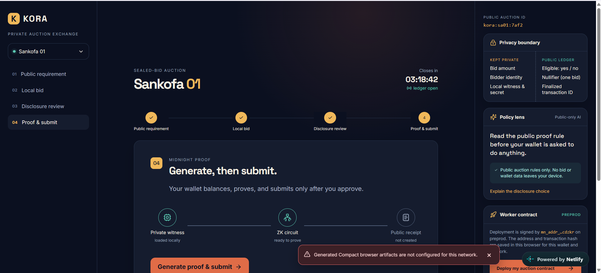
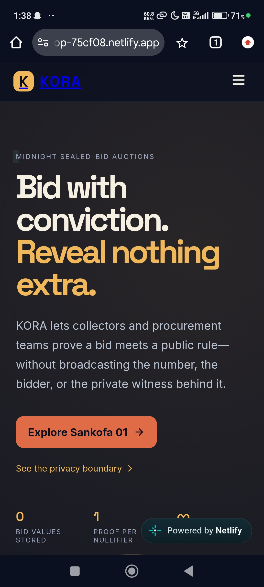
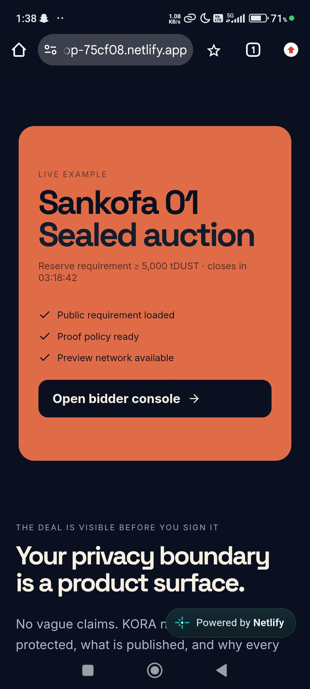
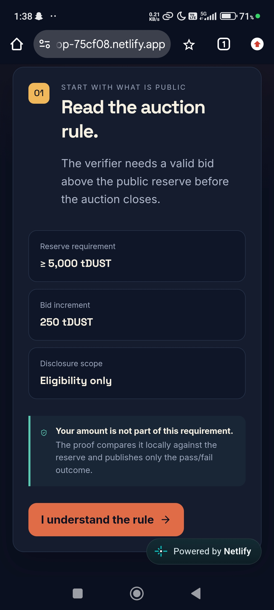

# KORA — Private Auction Exchange

KORA is an Afrofuturist, bidder-first sealed-bid auction experience for Midnight. It keeps bid values and witnesses local while publishing only a rule outcome, replay-protection nullifier, and real finalized receipt.

Live website: [https://sweet-gumdrop-75cf08.netlify.app/](https://sweet-gumdrop-75cf08.netlify.app/)

## Website Screenshots

### Homepage


### Bidder journey


### Bidder console


## Mobile responsive ui

Screenshots from the live mobile experience:

### Landing page


### Live auction overview


### Auction rule


## Run
`npm install && npm run dev` • `npm test` • `npm run lint` • `npm run build`

Backend: `uv venv .venv --python 3.11 && uv pip install --python .venv/Scripts/python.exe -r backend/requirements.txt`, then `uvicorn app.main:app --app-dir backend --reload`. Run tests with `PYTHONPATH=backend .venv/Scripts/python.exe -m pytest backend/tests`.

## Privacy and services
The frontend discovers UUID-keyed providers in `window.midnight`, prefers 1AM, and resets the session on Preview/Preprod changes. Gemini receives only redacted public auction policy text and returns a validated proof-plan fallback. The backend uses `DATABASE_URL` for PostgreSQL traffic. Never place a witness, secret, bid, or document in the database.

The auction console connects through 1AM's DApp Connector v4 on the selected network. Each connected wallet can deploy its own auction from the browser. The app stores the returned contract address and deployment transaction hash in local storage, scoped to the wallet address and network. Deployment records stay in that browser profile and are not synced between devices.

Contract deployment requires generated Compact browser artifacts to be bundled with the frontend and to expose `window.koraCompact.deployAuctionContract({ network, walletAddress, wallet })`. That function must use the generated contract and the connected wallet to deploy on Midnight, then return `{ contractAddress, transactionHash }` from the real deployment receipt. The UI rejects missing or incomplete receipts; it does not generate placeholder addresses or hashes. Until the generated contract binding is built into the frontend, the deploy action reports that setup is incomplete.

## Deploy: Netlify frontend + Render API

The frontend is a static Vite site on Netlify; the FastAPI backend runs as a Docker web service on Render. They deploy independently from the same repository. `netlify.toml` already sets the build command (`npm run build`), publish directory (`dist`), SPA route fallback, and security headers. `render.yaml` already configures the API Dockerfile and `/health` check.

The Render API Blueprint uses the Free plan. Free web services spin down after 15 minutes without traffic and can take about a minute to wake on the next request; their filesystem is ephemeral, so keep production data in PostgreSQL rather than local files. This tier is suitable for a demo, not production availability. [Render free service limits](https://render.com/docs/free)

1. Push the repository to GitHub, then create a Netlify site by importing that repository. Keep the base directory at the repository root; Netlify reads the build settings from `netlify.toml`.
2. Create a Neon Postgres project (or use another managed PostgreSQL provider). Copy its pooled connection URL for the API.
3. In Render, create a new Blueprint from the same repository and apply `render.yaml`. When prompted, set `DATABASE_URL` and `CORS_ORIGINS`; leave `GEMINI_API_KEY` blank if Gemini is not enabled. Render supplies `PORT` automatically.
4. After the Render service is live, copy its public URL (for example, `https://kora-public-api.onrender.com`). In Netlify's site environment variables, set `VITE_API_BASE_URL` to that URL with no trailing slash, then redeploy the site. Vite embeds this public API URL at build time, so a new build is needed after changing it.
5. Update Render's `CORS_ORIGINS` to the exact Netlify production origin, such as `https://your-site.netlify.app` (no path or trailing slash). If you add a custom domain, include that origin too, comma-separated. Save and redeploy the Render service.
6. Verify `https://YOUR-RENDER-SERVICE.onrender.com/health` returns `{"status":"ok",...}`, then open `https://YOUR-SITE.netlify.app/auction` and check the API-backed proof-plan interaction.

### Environment variables

Set only `VITE_API_BASE_URL` in Netlify:

```text
VITE_API_BASE_URL=https://YOUR-RENDER-SERVICE.onrender.com
```

Set these in Render's service environment:

```text
DATABASE_URL=postgresql://...your-pooled-provider-url...
CORS_ORIGINS=https://YOUR-SITE.netlify.app
GEMINI_API_KEY=                 # optional; leave unset to use the fallback plan
GEMINI_MODEL=gemini-2.5-flash   # optional; this is the default
```

`DATABASE_URL` must point to a persistent PostgreSQL database in production; the local SQLite default is only for development. The API creates its initial tables at startup. The Alembic files are not currently wired into the Render image, so `DATABASE_URL_UNPOOLED` is not required for this deployment. Add migration execution before relying on Alembic for future schema changes.

Never put database URLs or Gemini keys in Netlify, the frontend `.env`, or any `VITE_*` variable: Vite bundles `VITE_*` values into public browser code. `VITE_MIDNIGHT_NETWORK`, `MIDNIGHT_CONTRACT_ADDRESS`, and `VITE_KORA_CONTRACT_ADDRESS` are not read by the current app; choose Preview or Preprod in the auction UI instead. The contract deployment still requires generated Compact browser artifacts and `window.koraCompact.deployAuctionContract(...)`, as described above.

`docker compose up --build` runs the API locally; add `--profile proof` only after replacing the proof-server scaffold with the official network image and generated Compact artifacts.

## Privacy boundary
Gemini is invoked only when `GEMINI_API_KEY` is set and receives redacted public requirement text. The database persists only transaction IDs, proof outcome, scope, and aggregate counts. No bid amount, witness, secret, identity, or raw credential is accepted by the receipt schema. KORA does not simulate success. See `docs/` for the product, privacy model, and demo.
